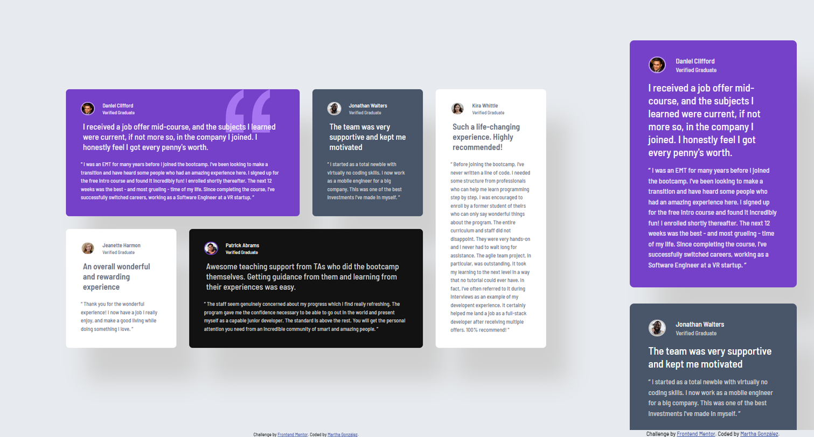

# Frontend Mentor - Testimonials grid section solution

This is a solution to the [Testimonials grid section challenge on Frontend Mentor](https://www.frontendmentor.io/challenges/testimonials-grid-section-Nnw6J7Un7). Frontend Mentor challenges help you improve your coding skills by building realistic projects. 

## Table of contents

- [Overview](#overview)
  - [The challenge](#the-challenge)
  - [Screenshot](#screenshot)
  - [Links](#links)
- [My process](#my-process)
  - [Built with](#built-with)
  - [What I learned](#what-i-learned)
  - [Continued development](#continued-development)
  - [Useful resources](#useful-resources)
- [Author](#author)
- [Acknowledgments](#acknowledgments)

## Overview

### The challenge

Users should be able to:

- View the optimal layout for the site depending on their device's screen size

### Screenshot

- Right: Mobile version (375px width)
- Left: Desktop version (1440px width)

### Links

- Solution URL: [Add solution URL here](https://your-solution-url.com)
- Live Site URL: [Add live site URL here](https://your-live-site-url.com)

## My process

### Built with

- Semantic HTML5 markup
- CSS custom properties
- Flexbox
- CSS Grid
- Mobile-first workflow
- CUBE CSS methodology

### What I learned

- Knowing the proper amount of containers is key. Don't hesitate to add another if needed.
- I keep making improves on working with the CUBE CSS Methodology. I'm getting used to it in almost an instinctual level which helps a lot with the workflow. 
- Class `light-f3` was created and successfully set in order to fill the font color requirement of the first container (`tes-container1`). 
- I've been improving my Git knowledge as well and it sproper use. Now I'm trying to seperate the mobile from the desktop version by making branches to ensure nothing is altered by mistake.
- The quotation mark on the background gave me some work and took me reviewing the background property to fulfill the requirement.
- Media queries were created for 1280px and 1440px. Meeting the requirements successfully.

### Continued development

I'm really proud of the work I did here. I can't wait to keep going working on the grid or reviewing some elements.

### Useful resources

- [CSS box-shadow property](https://www.w3schools.com/cssref/css3_pr_box-shadow.php): Excellent resource to understand the box-shadow property.
- [CSS minmax() function](https://www.w3schools.com/cssref/func_minmax.php): Great resource for the minmax function, especially its platform to try it.
- [background-position CSS | MDN](https://developer.mozilla.org/en-US/docs/Web/CSS/background-position): Great resource to work the background position.

## Author

- Frontend Mentor - [@margga88](https://www.frontendmentor.io/profile/margga88)

## Acknowledgments

I'd like to thank Frontend Mentor and its community for these challenges and their feedback.
